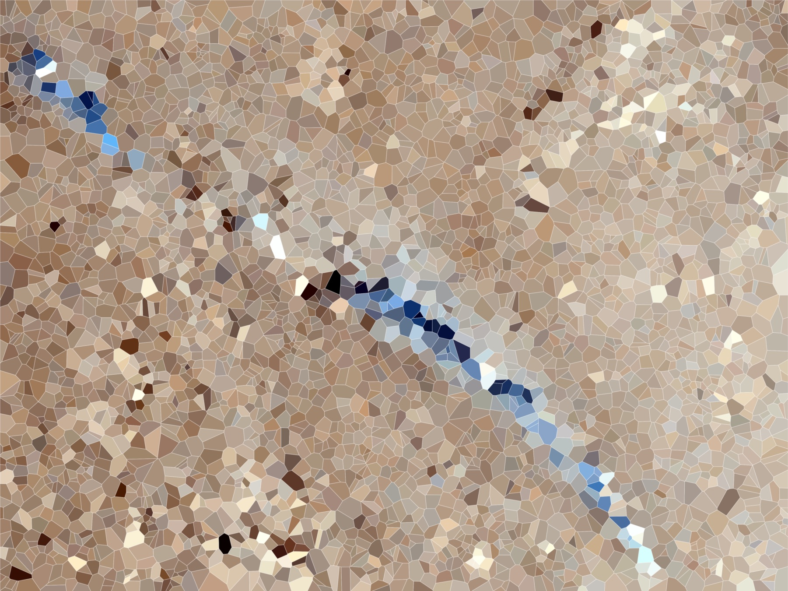

# Arte Generativo



## Resumen

El arte generativo se define como cualquier práctica artística en la que el artista use un sistema, ya sea un conjunto de reglas, máquina, computadora o cualquier procedimiento análogo, para realizar, de manera autónoma, una pieza de arte, aportando elementos matemáticos aleatorios al proceso creativo. Y éste no se limita a la pintura digital, también se desarrolla en la literatura, música, escultura y arquitectura. Philip Galanter

Cuando el artista entra en colaboración con alguna suerte de autómata creador, y resigna el poder de decidir cada detalle de lo que sucede en la obra, ese diálogo es el que permite lo generativo.

El codigo en su de expresión, permite al artista la búsqueda de la emergencia de ese dialogo entre la maquina y la creación. El arte no es algo que haga una sola persona, sino un proceso puesto en movimiento.

## descripción del taller

Estos sketch son el material para un tallter o un espacio para la experimentación sobre procesos generativos, pero tambíen vale como como elementos únicos para arrancar un proceso creativo.

### Rudimentos como formas primitivas

Estos elementos son como primitivos básicos del código generativo. Como los patrones de diseños en el software, o como el toroide, esfera o cubo en el mundo del 3D. El arte generativo básado en codigo tiene una materia prima básica y estos sketch con una pequeña muestra. El arte generativo es infinito, estos rudimentos básicos son un inicio, un primer paso que muchos hemos dados al iniciar un proceso de creación generativo. Los bucles, el ruido, las matrices, los matices, los vertices, los vectores, con nuestro oleo o nuestro pincel, piezas mínimas, con las que dar forma a una creación

## Install

Solo se necesitara un servidor estatico, lr-http-server por el livereload, un editor para trabajar con javascript

```
npm install -g lr-http-server

```

## Uso

Una vez en el directorio del repositorio se lanza el comando `lr-http-server` esto levanta un servidor web con livereload y nos permite trabajar con los sketch.

## Contenido del repositorio

En este taller no se busca una proceso de aprendizaje clásico donde un conjunto de conocimientos son impartidos por una jerarquía, y ese conocimiento se apilan uno sobre otro.
Estos elementos, estos legajos, estos sketch, son rudimentos, son elementos primitivos con los que buscar las emergencias.

## Técnologia

Para el taller vamos a usar [p5js](https://p5js.org/) un proyecto entorno al código creativo ten a manos la referencia [reference/](https://p5js.org/reference/) te será útil

## Enlaces

[https://en.wikipedia.org/wiki/12_basic_principles_of_animation](https://en.wikipedia.org/wiki/12_basic_principles_of_animation)
[https://twitter.com/genekogan](https://twitter.com/genekogan)
[Random](http://www.mywonderland.es/curso_js/processing/pro_mate3.htm)

Karlos G. Liberal aka [Patxangas](https://twitter.com/patxangas)
